# TidyTuesday
Figuras generadas a partir de los datos publicados por [TidyTuesday](https://github.com/rfordatascience/tidytuesday#readme).

# 2023

## Semana 25

Nube de palabras a aprtir de las descripciones de avistamientos de OVNIs

[Script](2023/semana_25/2023-s25_script.R)

## Semana 24

Encuestas a granjeros de Tanzania y Mozambique muestran sus pertenencias.

[Script](2023/semana_24/2023-s24_script.R)

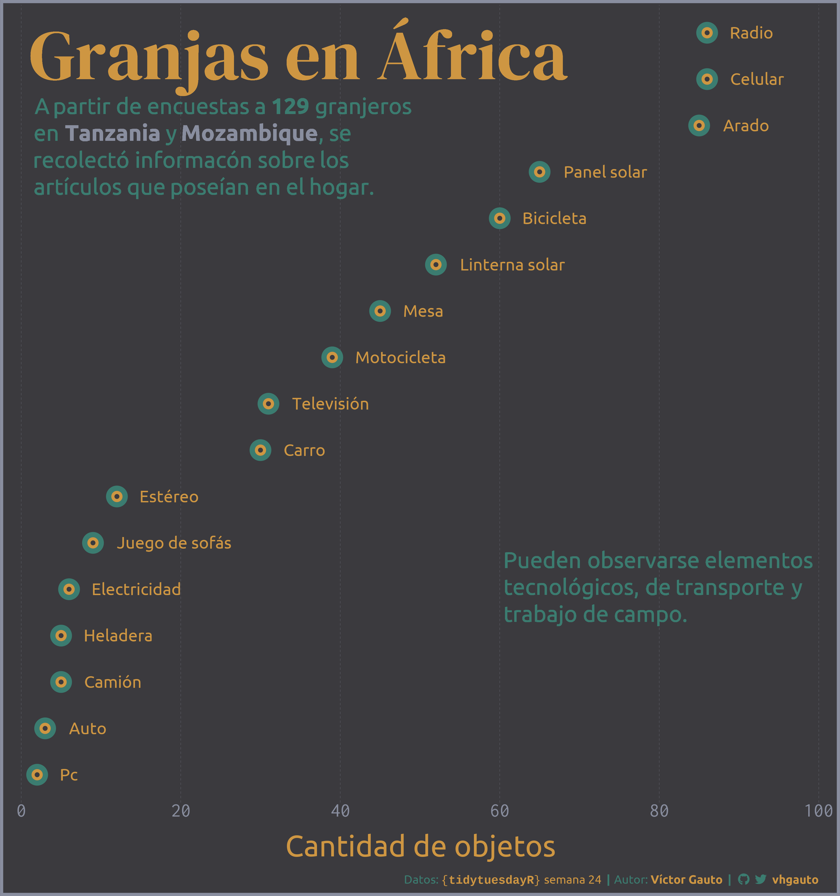

## Semana 23

Consumo energético argentino, y su comparación con los valores medios mundiales. En combustibles fósiles y renovables.

[Script](2023/semana_23/2023-s23_script.R)

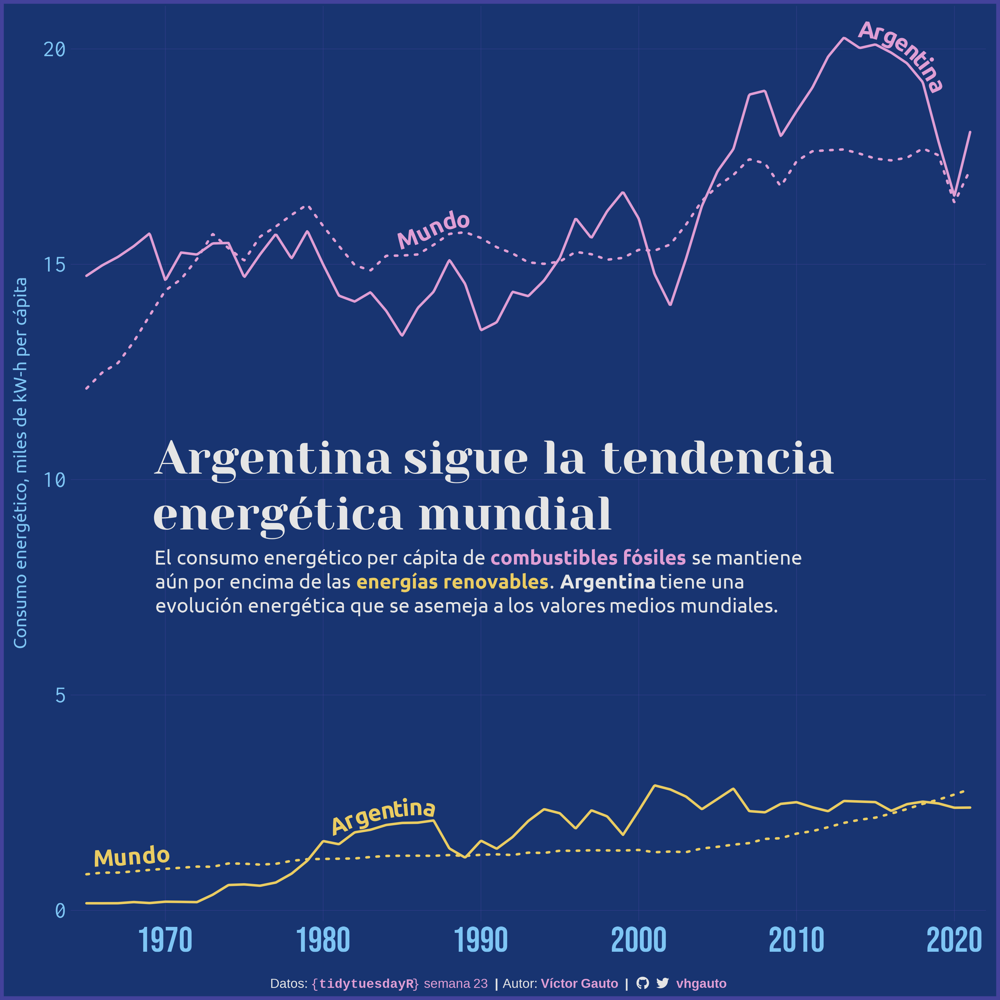

## Semana 22

La persona más longeva registrada, Jeanne Calment.

[Script](2023/semana_22/2023-s22_script.R)

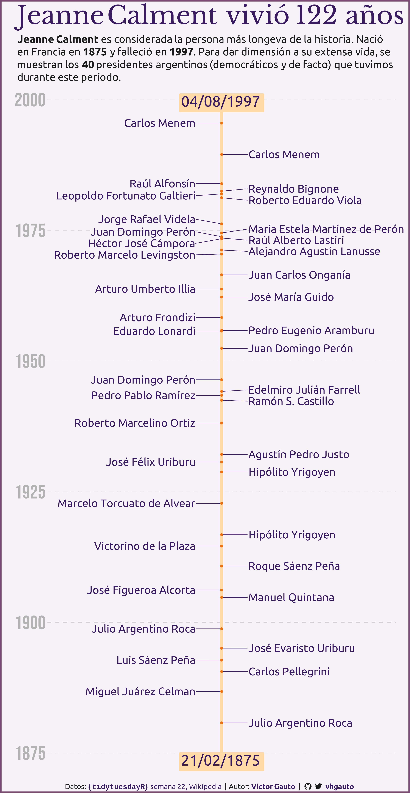

## Semana 21

Ardillas en Central Park.

[Script](2023/semana_21/2023-s21_script.R)

## Semana 20

Tornados en EEUU.

[Script](2023/semana_20/2023-s20_script.R)

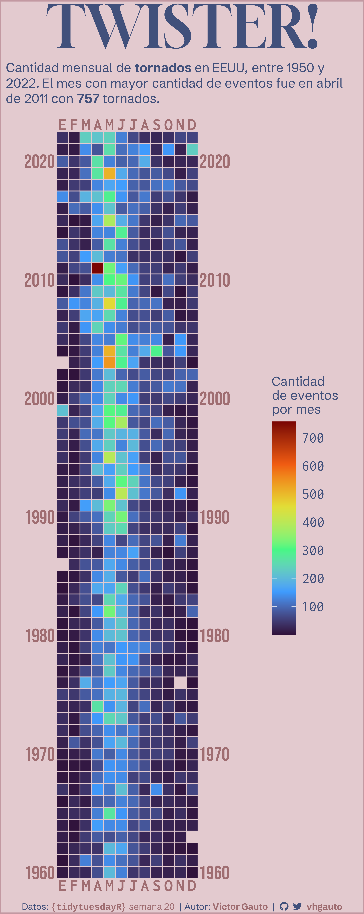

## Semana 19

Costo asociado al cuidado de bebés.

[Script](2023/semana_19/2023-s19_script.R)

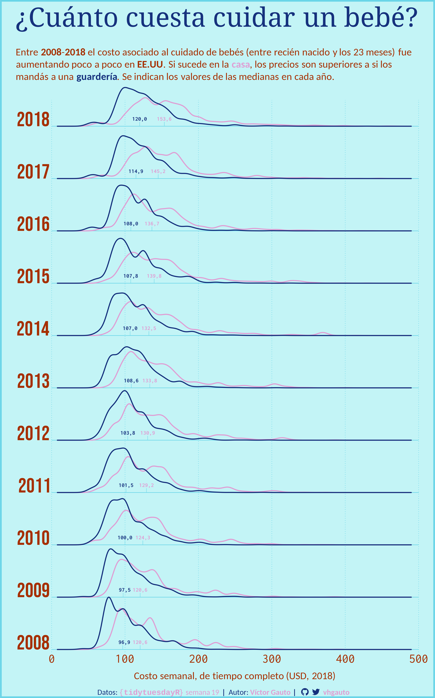

## Semana 18

Roedores de Arizona.

[Script](2023/semana_18/2023-s18_script.R)

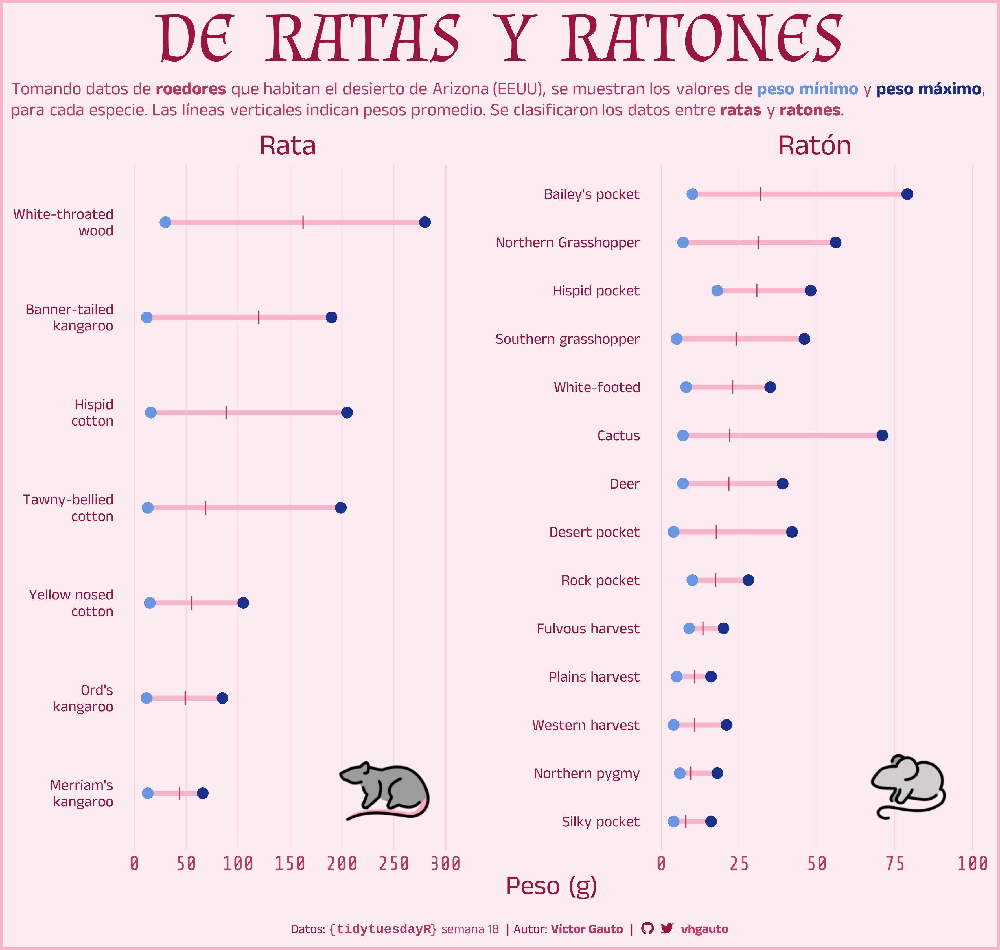

## Semana 17

Maratón de Londres.

[Script](2023/semana_17/2023-s17_script.R)

## Semana 16

Alimentación del período Neolítico.

[Script](2023/semana_16/2023-s16_script.R)

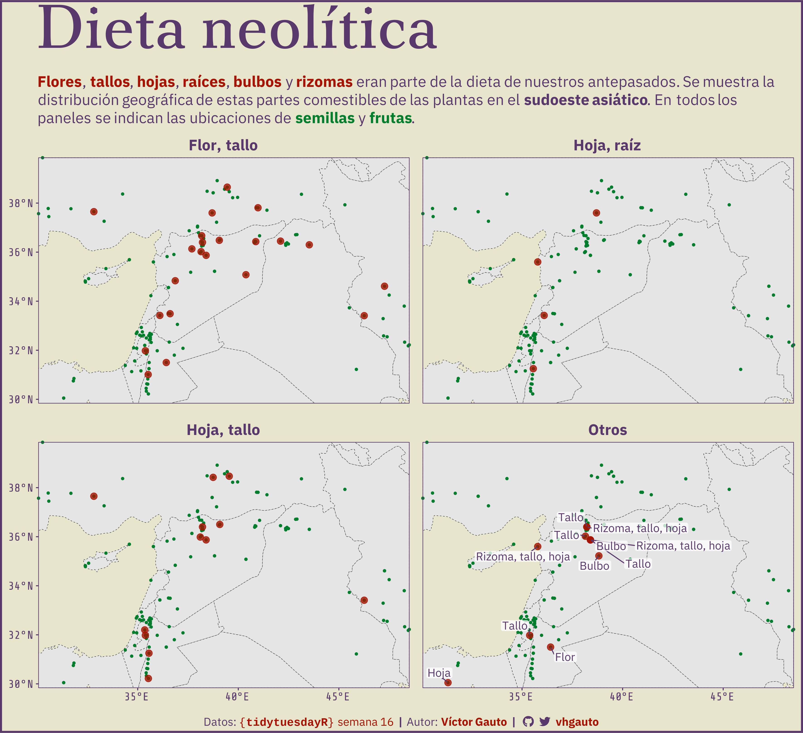

## Semana 15

Producción de huevos.

[Script](2023/semana_15/2023-s15_script.R)

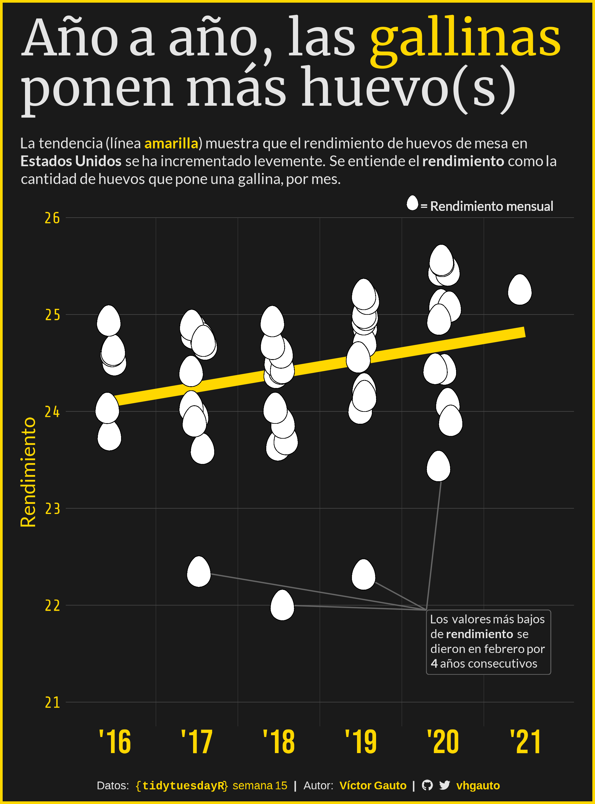

## Semana 14

Premier League.

[Script](2023/semana_14/2023-s14_script.R)

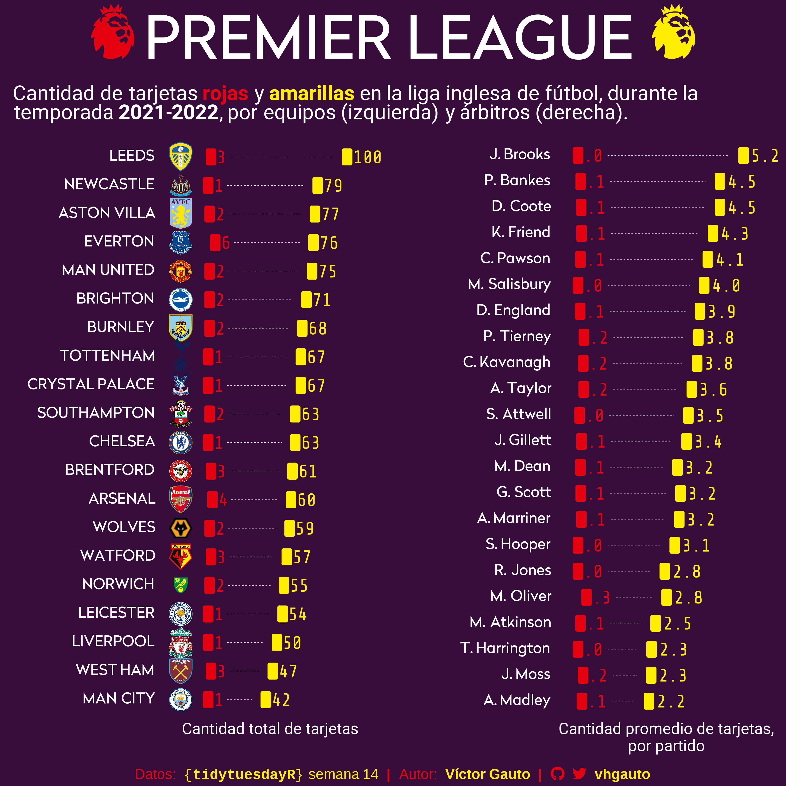

## Semana 13

Husos horarios.

[Script](2023/semana_13/2023-s13_script.R)

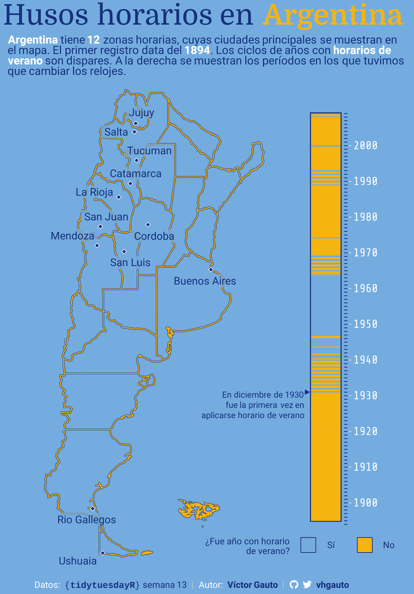

## Semana 12

Lenguajes de programación y sus comentarios.

[Script](2023/semana_12/2023-s12_script.R)

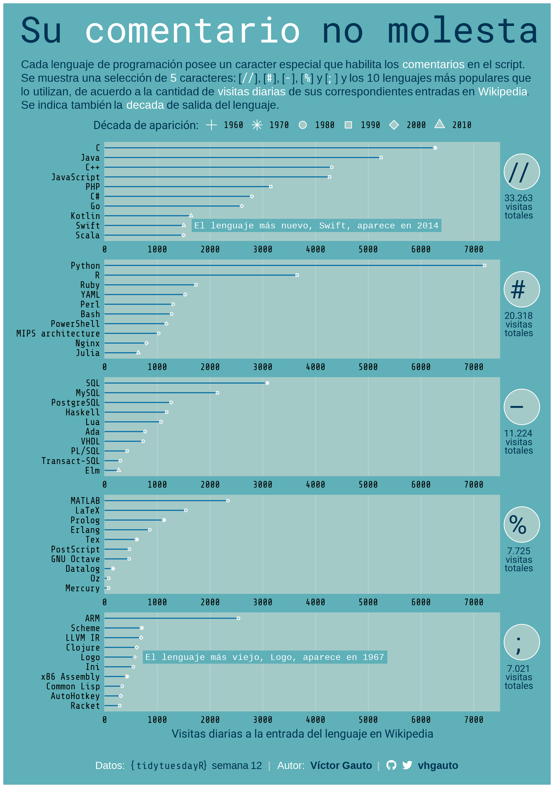

## Semana 7

Deferencia de edad entre parejas en películas de Hollywood.

[Script](2023/semana_07/2023-s07_script.R)

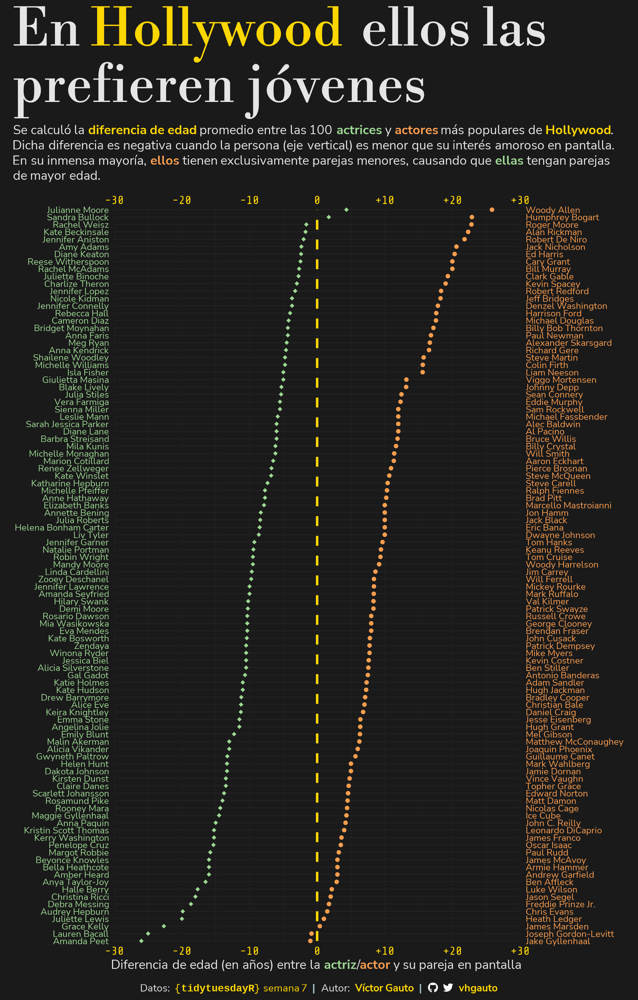
