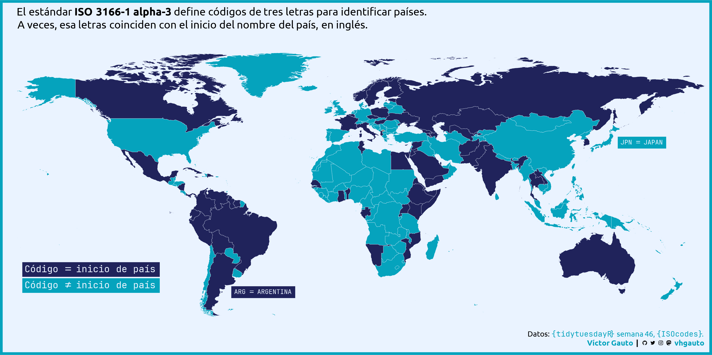
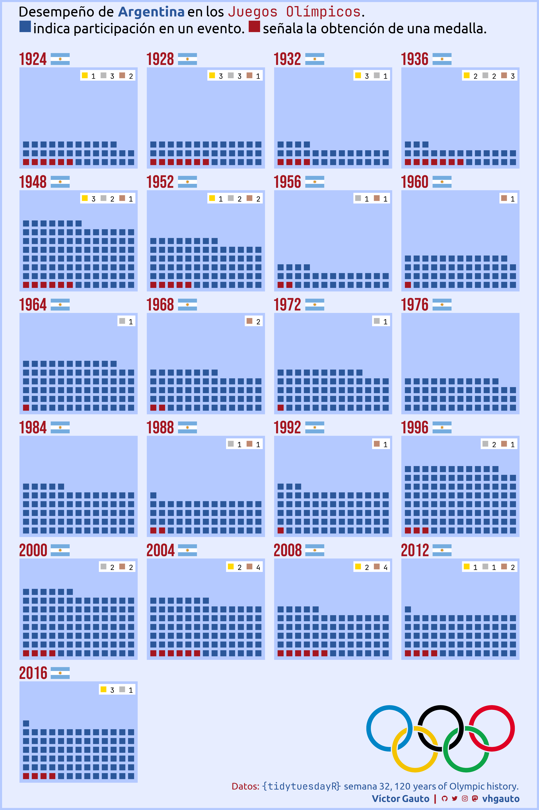
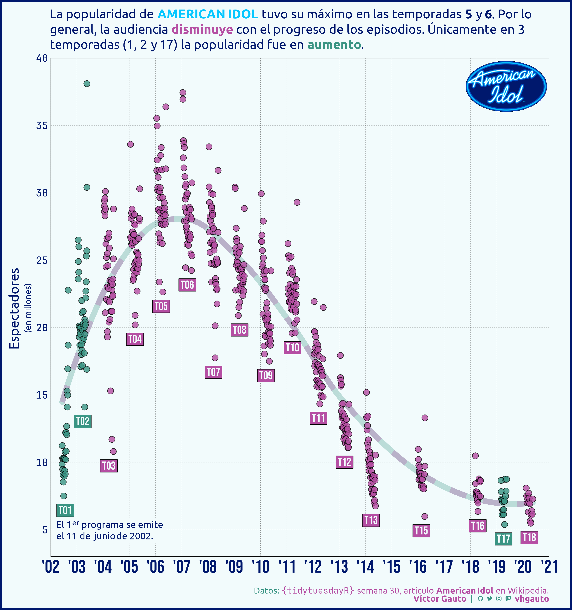

# TidyTuesday

Figuras generadas a partir de los datos publicados por [TidyTuesday](https://github.com/rfordatascience/tidytuesday#readme).

## [TidyTuesday 2023](2023/README.md)

# 2024

## Semana 51

Cantidad de hechizos por escuela y nivel en <b>Dungeons & Dragons</b>.

[Script](2024/s51/script.R)

## Semana 50

Popularidad en fragancias de perfumes.

[Script](2024/s50/script.R)

## Semana 49

Velocidad de vehículos, por tamaño y horario, en Inglaterra.

[Script](2024/s49/script.R)

## Semana 48

Encuentros en las fronteras Norte y Sur de Estados Unidos.

[Script](2024/s48/script.R)

## Semana 47

Uso de signos de exclamación e interrogación en episodios de <b>Bob's Burger</b>.

[Script](2024/s47/script.R)

## Semana 46

Códigos ISO 3166-1 de 3 letras que son iguales al inicio del nombre del país, en inglés.

[Script](2024/s46/script.R)

## Semana 45

Porcentaje de democracias, presidencias y monarquías.

[Script](2024/s45/script.R)

## Semana 44

Palabras anteriores y posteriores a los títulos de películas de <b>MONSTRUOS</b>.

[Script](2024/s44/script.R)

## Semana 43

Posición Argentina en superficie, acceso a internet, población y expectativa de vida.

[Script](2024/s43/script.R)

## Semana 42

Avistamiento de orcas en el Mar de los Salish.

[Script](2024/s42/script.R)

## Semana 41

Especies nativas y no nativas en Parques Nacionales de EE.UU.

[Script](2024/s41/script.R)

## Semana 40

Duración y cantidad de turnos en el ajedrez.

[Script](2024/s40/script.R)

## Semana 39

Participación Argentina en las Olimpiadas de Matemáticas Internacionales.

[Script](2024/s39/script.R)

## Semana 38

Líneas habladas por los personajes principales en tres obras de William Shakespeare.

[Script](2024/s38/script.R)

## Semana 37

Diferencia entre los ingresos a Universidades de Elite, comparado con Universidades públicas, según los ingresos en el hogar.

[Script](2024/s37/script.R)

## Semana 36

Opiniones de usuarios de Argentina en stack<b>overflow</b> respecto de la Inteligencia Artificial.

[Script](2024/s36/script.R)

## Semana 35

Popularidad y puntaje de episodios de los <b>Power Rangers</b>, dividido entr las primeras y las últimas cinco temporadas.

[Script](2024/s35/script.R)

## Semana 34

Edades de reyes/reinas ingleses comparados con sus consortes.

[Script](2024/s34/script.R)

## Semana 33

Ferias Internacionales y la relación entre asistentes y superficie.

[Script](2024/s33/script.R)

## Semana 32

Participación de Argentina en los Juegos Olímpicos.

[Script](2024/s32/script.R)

## Semana 31

Puntaje de películas con `summer` en el título, y la mejor calificada por género.

[Script](2024/s31/script.R)

## Semana 30

Audiencia de <b>American Idol</b>.

[Script](2024/s30/script.R)

## Semana 29

Presencia en las tribunas de los partidos de <b>Fútbol Femenino Inglés</b>, indicando el equipo más popular por año.

[Script](2024/s29/script.R)

## Semana 28

Paquetes y funciones más frecuentes en este repositorio, utilizando el paquete [`{funspotr}`](https://brshallo.github.io/funspotr/).

[Script](2024/s28/script.R)

## Semana 27

Datos geográficos presentes en los datasets de TidyTuesday.

[Script](2024/s27/script.R)

## Semana 26

Géneros de películas con temática LGBTQ.

[Script](2024/s26/script.R)

## Semana 25

Feriados en EE.UU. y el año en que fueron establecidos.

[Script](2024/s25/script.R)

## Semana 24

El <b>Campus Pride Index</b> clasifica los campus universitarios de EE.UU.

[Script](2024/s24/script.R)

## Semana 23

Máximo contenido graso de diferentes quesos por país.

[Script](2024/s23/script.R)

## Semana 22

Plantaciones por lote y año del paquete <code>[{gardenR}](https://github.com/llendway/gardenR)</code>

[Script](2024/s22/script.R)

## Semana 21

Proporción entre empresas estatales y privadas en la generación de CO2.

[Script](2024/s21/script.R)

## Semana 20

¿Cuánto es lo máximo que pagaron por café? La respuesta varía según si la persona conoce o no el origen del café.

[Script](2024/s20/script.R)

## Semana 19

Semanas en el ranking de <b>Rolling Stone</b>, separados por género del álbum.

[Script](2024/s19/script.R)

## Semana 18

Edad media de los empleados públicos y privados, en el sector salud y educación, en Argentina.

[Script](2024/s18/script.R)

## Semana 17

Lanzamientos de objetos espaciales por Argentina.

[Script](2024/s17/script.R)

## Semana 16

Paquetes que dependen de <code>{ggplot2}</code>, asociados a <code>{shiny}</code>.

[Script](2024/s16/script.R)

## Semana 15

Ciudades alcanzadas total o parcialmente por los eclipses solares de 2023 y 2024, en EE.UU.

[Script](2024/s15/script.R)

## Semana 14

Profesiones de personas negras graduadas en 1900 en la Universidad de Atlanta.

[Script](2024/s14/script.R)

## Semana 13

Expectativas e historial de la **Asociación Nacional Deportiva Universitaria**, en EE.UU.

[Script](2024/s13/script.R)

## Semana 12

Personajes de <b>X-Men</b> populares.

[Script](2024/s12/script.R)

## Semana 11

Empresas con categoría **501(c)(3)**, por década.

[Script](2024/s11/script.R)

## Semana 10

Tendencias en la recolección de basura de [Mr. Trash Wheel](https://www.mrtrashwheel.com/).

[Script](2024/s10/script.R)

## Semana 9

29 personas nacidas/muertas un 29 de febrero, de acuerdo al artículo de [Wikipedia](https://en.wikipedia.org/wiki/February_29) dedicado a la fecha.

[Script](2024/s09/script.R)

## Semana 8

Financiamiento de proyectos de [**R Consortium**](https://www.r-consortium.org/).

[Script](2024/s08/script.R)

## Semana 7

Consumos durante **San Valentín** y cambio en el porcentaje de personas que participan.

[Script](2024/s07/script.R)

## Semana 6

Mapa de Patrimonios de la Humanidad de UNESCO, inspirado en esta [figura](https://100.datavizproject.com/data-type/viz46/) de [1 dataset, 100 visualizations](https://100.datavizproject.com/).

[Script](2024/s06/script.R)

## Semana 5

Marmotas que predicen el clima.

[Script](2024/s05/script.R)

## Semana 4

Logros educativos y su relación con los ingresos, en Reino Unido.

[Script](2024/s04/script.R)

## Semana 3

Lugares de votación en EE.UU., para cuatro elecciones.

[Script](2024/s03/script.R)

## Semana 2

Diferencias en los meses de nacimientos en Canadá y NHL.

[Script](2024/s02/script.R)

